# Manifesto 3 — **Threat Model + DPIA (LGPD) + Políticas de Segurança**

*(ObraFlow · pacote inicial completo, integrado com padrões do monorepo multilíngue)*

Este manifesto de segurança e privacidade foi **integrado com os padrões técnicos** definidos no plano de ação do monorepo, garantindo alinhamento entre arquitetura, desenvolvimento e operações. Inclui: modelagem de ameaças (STRIDE), privacidade (LINDDUN/LGPD), inventário de dados, DPIA, políticas e controles, com **templates executáveis** (OPA/Rego), **diagramas PlantUML** (DFD/Sequence), **matriz de controles** e **checklists**.

## 🔒 Integração com Padrões de Segurança do Monorepo

### Stack de Segurança Integrada
- **Autenticação**: OIDC/OAuth2 com JWT (RS256), tokens curtos, JTI
- **Autorização**: RBAC/ABAC com OPA/Rego, RLS no PostgreSQL
- **Criptografia**: TLS 1.3+, mTLS mesh, KMS para chaves
- **Auditoria**: Logs estruturados com correlation_id, trilha imutável
- **Compliance**: LGPD, ISO 27001, SOC 2, NIST framework

### Padrões de Segurança Aplicados
- **SAST**: CodeQL, Semgrep para análise estática
- **SBOM**: Syft para inventário de dependências
- **Image Scanning**: Trivy para vulnerabilidades em containers
- **Dependency Review**: Dependabot + pnpm audit + govulncheck
- **Secret Scanning**: Gitleaks para detecção de segredos

---

## 📁 Estrutura de arquivos

```
docs/
  10-architecture/
    security-threat-model/
      README.md
      threat-model.md
      dfd-context.puml
      seq-authz-mobile-sync.puml
      data-inventory.md
      ropa.md
      dpia.md
      controls-matrix.yaml
      checklists.md
      policies/
        access-control.md
        crypto-kms.md
        secrets-management.md
        logging-privacy.md
        vulnerability-management.md
        incident-response.md
        dlp.md
        sso-oidc.md
        tenancy-rbac-abac.md
        api-hardening.md
        opa/
          authz.rego
          pii-redaction.rego
```

---

## 1) `README.md` — Guia de Navegação

```markdown
# Threat Model + DPIA (LGPD) — ObraFlow

Este pacote consolida: **modelagem de ameaças (STRIDE)**, **privacidade (LINDDUN)**,
**inventário de dados (RoPA)**, **DPIA**, **políticas e controles**, **OPA/Rego**,
**DFD/Sequência** e **checklists**.

## Objetivos
- Prevenir e detectar incidentes de segurança e privacidade.
- Tornar **auditável** a conformidade LGPD por processo e dado.
- Integrar segurança por design aos fluxos críticos (mobile offline-first, OS→Medição, Suprimentos).

## Como usar
1. Adapte `data-inventory.md` e `ropa.md` com sua realidade (campos e bases).
2. Revise `threat-model.md` e os diagramas `*.puml` (renderize com PlantUML).
3. Preencha o `dpia.md` (riscos residuais e mitigação).
4. Publique as políticas em `policies/` e aplique os exemplos **OPA/Rego**.
5. Anexe evidências em `controls-matrix.yaml` e use `checklists.md` por release.
```

---

## 2) `threat-model.md` — STRIDE + LINDDUN (resumo prático)

```markdown
# Threat Model — STRIDE + LINDDUN

## Escopo
- Frontends (Web Next.js / Mobile Offline-First), BFF (NestJS), Serviços (Go/Nest),
  Kafka, Postgres (RLS), Mongo, S3/MinIO, OpenSearch, Redis, Vector DB, OIDC, Observabilidade.

## Assunções
- mTLS intra-cluster (mesh), TLS externo, OIDC com tokens curta duração, KMS para chaves.
- Multi-tenant lógico (RLS + namespaces), PII minimizada, logs estruturados com redaction.

## STRIDE (principais)
| Ativo                          | Ameaça (STRIDE)     | Vetor típico                                    | Controle principal                                 | Evidência            |
|-------------------------------|---------------------|--------------------------------------------------|----------------------------------------------------|----------------------|
| Token OIDC/JWT                | **Spoofing**        | Reuso/replay, token vazado                      | JTI, exp curto, rotate keys, token binding (DPoP)  | sso-oidc.md          |
| Eventos Kafka (OS/Med.)       | **Tampering**       | Produtor malicioso altera payload               | Assinatura/Envelope+schema, ACL SASL/SCRAM         | event-catalog        |
| Logs com PII                  | **Information Disc.**| Logar campos sensíveis                          | Redaction automática + DLP + masking               | logging-privacy.md   |
| Banco (Postgres/Mongo)        | **Elevation of Priv.**| Credenciais reusadas                             | IAM mínimo, RLS, Secrets Manager + rotation        | secrets-management.md|
| Storage (S3/MinIO - mídia)    | **Repudiation**     | Falta de trilha ou hash de evidências           | Audit log imutável + hash/ETag + cadeia de custódia| logging-privacy.md   |
| Mobile Sync                   | **DoS**             | Requisições em massa, sync poluidor             | Rate-limit/tenant, quotas, backoff, circuit        | nfr-charter.yml      |
| API BFF                       | **Tampering**       | Bypass de validação, mass assignment            | Zod/Joi, DTOs imutáveis, allowlist, anti-BOLA      | api-hardening.md     |

## LINDDUN (privacidade)
| Dimensão | Risco                                | Causa/Fluxo                      | Mitigação                                          |
|----------|--------------------------------------|----------------------------------|----------------------------------------------------|
| Linkability | Associar eventos a um titular     | `tenantId+siteId+foto`           | Pseudonimização, hashing, separação de chaves      |
| Identifiability | Re-identificação por mídia    | Upload de fotos com rostos       | Blur/EPI-check, consentimento, DLP no upload       |
| Non-compliance | Retenção excessiva             | Logs e mídia sem TTL             | Retention policies (90/365d), expurgo automatizado |
| Detectability | Exposição de padrões de uso     | Analytics sem anonimização       | Amostragem, agregação, k-anonymity onde aplicável  |
| Unawareness | Consentimento implícito           | Geolocalização/voz               | Consent UI, toggle por feature, registros de consent|

## Requisitos macro
- **Política de dados**: minimização, TTL, acesso por papel/obra.
- **Criptografia**: TLS 1.3+, mTLS mesh, TDE onde aplicável, KMS para KEKs/DEKs.
- **Auditoria**: trilha imutável, correlação (correlation_id), hash de mídia.
- **Resiliência**: rate-limit, quotas, isolamento por tenant (RLS/namespace).
- **Automação**: CI/CD security gates, auto-remediation, policy-as-code.
- **Monitoramento**: SIEM integration, threat detection, anomaly alerts.
- **Compliance**: LGPD, ISO 27001, SOC 2, NIST framework.
- **Zero Trust**: verificação contínua, least privilege, micro-segmentation.
```

---

## 3) `dfd-context.puml` — DFD (Data Flow Diagram) de alto nível

```plantuml
@startuml dfd-context
' Diagrama de Fluxo de Dados — contexto macro
!pragma teoz true
left to right direction
skinparam shadowing false
skinparam defaultFontName Inter

actor Mobile as A
actor Web as B
rectangle "BFF/API (NestJS)" as BFF
rectangle "Serviços (Go/Nest)" as SVC
database "Postgres (RLS)" as PG
database "Mongo" as MG
cloud "Kafka" as KAFKA
cloud "S3/MinIO (Mídia)" as S3
cloud "OIDC (IdP)" as OIDC
cloud "Observabilidade (OTel/Tempo/Prom/Loki)" as OBS

A -> BFF : Auth + Sync (TLS)
B -> BFF : Auth + APIs (TLS)
BFF -> OIDC : OIDC/OAuth2
BFF -> SVC : gRPC/HTTP (mTLS)
SVC -> KAFKA : Eventos (SASL/SSL)
SVC -> PG : CRUD/Projeções (mTLS)
SVC -> MG : Docs/Checklists (mTLS)
SVC -> S3 : Upload/Evidências (TLS)
SVC -> OBS : Telemetria (OTLP)

note bottom of S3
  PII na mídia sujeita a DLP
  + retenção/expurgo
end note
@enduml
```



---

## 4) `seq-authz-mobile-sync.puml` — Sequência (AuthZ + Sync Mobile)

```plantuml
@startuml seq-authz-mobile-sync
autonumber
actor Mobile
participant BFF as "BFF/API"
participant IdP as "OIDC"
participant Work as "Work-Management"
participant ES as "Event Store/Projections"
participant Kafka as "Kafka"

Mobile -> BFF: Login (PKCE)
BFF -> IdP: Code -> Tokens (AT/RT), JTI curto
IdP --> BFF: AT/RT (scopes, tenant)
BFF --> Mobile: AT + Refresh (httpOnly cookie ou secure storage)

Mobile -> BFF: Sync (If-None-Match: etag, x-tenant-id)
BFF -> Work: Query projeções (RLS por tenant/site)
Work -> ES: Read models
ES --> Work: Projeções
Work --> BFF: Dados delta
BFF --> Mobile: Delta + correlation_id

Mobile -> BFF: POST apontamento (x-idempotency-key)
BFF -> Work: Command -> Outbox
Work -> Kafka: Publish (envelope c/ tenantId, correlationId)
@enduml
```



---

## 5) `data-inventory.md` — Inventário de Dados (por domínio)

```markdown
# Inventário de Dados (Data Inventory)

> Base para minimização, classificação, retenção e avaliação DPIA.

## Classificação
- **Público**, **Interno**, **Confidencial**, **Sensible/PII**.

## Tabela (amostra)
| Domínio        | Tabela/Índice             | Campos-chave                              | Classificação | TTL/Retenção | Base Legal (LGPD)            |
|----------------|---------------------------|-------------------------------------------|--------------:|-------------:|------------------------------|
| Work Mgmt      | work_orders (PG)          | wo_id, tenant_id, site_id, status         | Interno       | 2 anos       | Execução de contrato         |
| Work Mgmt      | productions (PG)          | wo_id, qty, timestamp, author_id          | Interno       | 2 anos       | Execução de contrato         |
| Field Ops      | media (S3)                | url, hash, tags, wo_id, uploader_id       | Sensível/PII  | 365 dias     | Consentimento/Legítimo Inter.|
| IAM            | users (IdP)               | subject_id, email, roles                  | Sensível/PII  | Ciclo de conta| Obrigação legal/Contrato     |
| Observability  | logs (Loki)               | message, severity, correlation_id         | Interno       | 30–90 dias   | Legítimo Interesse (SRE)     |
| Analytics      | events (OpenSearch)       | view/click/ai_suggestion*, hash user_id   | Interno       | 180 dias     | Legítimo Interesse (produto) |
| AI/ML          | embeddings (Vector DB)    | document_hash, tenant_id, content_hash    | Interno       | 365 dias     | Legítimo Interesse (IA)      |
| Audit          | audit_logs (Postgres)     | user_id, action, resource, timestamp      | Sensível      | 7 anos       | Obrigação legal              |
| Backup         | snapshots (S3)            | encrypted_data, metadata, checksums       | Sensível      | 2 anos       | Obrigação legal              |

> *Nunca armazenar PII em analytics; use hash/anonimização.
> **Classificação automática**: DLP detecta e classifica dados em tempo real.
> **Retenção automática**: TTL baseado em classificação e base legal.
```

---

## 6) `ropa.md` — Registros de Operações de Tratamento (RoPA)

```markdown
# RoPA — Registro de Operações (LGPD)

| Processo                     | Finalidade                                        | Dados            | Base Legal                 | Compartilhamento                  | Retenção      |
|-----------------------------|---------------------------------------------------|------------------|---------------------------|-----------------------------------|---------------|
| Execução de OS/Apontamentos | Registrar e comprovar execução de serviços        | Ident. usuário*, geoloc**, fotos*** | Contrato; Legítimo Interesse | Fiscal contratante; fornecedores (mínimo necessário) | 2 anos / mídia 365d |
| Segurança/Qualidade         | Prevenir incidentes e NC                          | Fotos/Vídeos***  | Consentimento; Interesses | Auditorias internas/externas      | 365 dias      |
| Autenticação                | Acesso e autorização                              | E-mail, roles    | Contrato; Obrigação legal | IdP (SSO)                          | Ciclo de conta|

\* IDs aplicam anonimização em logs;
\** Geolocalização sempre opt-in por perfil/tenant;
\*** Visão computacional aplica DLP (blur) quando configurado.
```

---

## 7) `dpia.md` — DPIA (Avaliação de Impacto à Proteção de Dados)

```markdown
# DPIA — ObraFlow

## 1. Descrição do tratamento
- Fluxos: execução de OS, inspeções, medições, suprimentos, observabilidade.
- Canais: Mobile/Web, APIs, mensageria, storage de mídia.

## 2. Necessidade e proporcionalidade
- Minimização: apenas dados operacionais; PII restrita a autenticação e evidências.
- Opções menos intrusivas: pseudo-ID de usuário em analytics; consent para geolocalização/mídia.

## 3. Riscos identificados (alto nível)
| Risco                                   | Prob. | Impacto | Nível | Mitigações-chave                                     |
|----------------------------------------|:-----:|:-------:|:----:|------------------------------------------------------|
| Vazamento de mídia com rosto           |  M    |   A     |  A   | DLP/blur, TTL 365d, escopo de acesso mínimo          |
| Reuso de token                         |  M    |   M     |  M   | JTI/exp curto, rotate keys, revogação, WAF           |
| Reidentificação em analytics           |  B    |   M     |  M   | Hash/anon, amostragem, agregação                     |
| Excesso de logs com PII                |  M    |   M     |  M   | Redaction, data minimization, revisão de campos      |
| Comprometimento de chaves KMS          |  B    |   A     |  A   | Rotação automática, envelope encryption, HSM         |
| Ataque de prompt injection (IA)        |  M    |   M     |  M   | Guardrails, sanitização, rate limiting               |
| Cross-tenant data access               |  B    |   A     |  A   | RLS, ABAC, network segmentation, audit logs          |
| Data exfiltration via API              |  M    |   M     |  M   | Rate limiting, anomaly detection, DLP scanning       |

## 4. Medidas de mitigação (mapa para políticas)
- Criptografia (crypto-kms.md), Acesso (access-control.md), DLP (dlp.md),
  Logs & Privacidade (logging-privacy.md), Secrets (secrets-management.md),
  Vulnerabilidades (vulnerability-management.md), Incidentes (incident-response.md).

## 5. Risco residual e aceite
- Após mitigação, riscos residuais **M/B**. Revisão semestral ou a cada mudança de escopo.

## 6. Envolvidos
- DPO/Encarregado, Segurança, Arquitetura, Jurídico, Produto.
```

---

## 8) `controls-matrix.yaml` — Matriz de Controles (mapeamento prático)

```yaml
controls:
  - id: SEC-AC-01
    title: RBAC/ABAC por tenant/obra
    mapped_to: [ISO27001:A.9, OWASP-ASVS:1.1]
    evidence: policies/tenancy-rbac-abac.md
  - id: SEC-CRYPTO-01
    title: KMS e rotação de chaves
    mapped_to: [ISO27001:A.10, NIST-800-57]
    evidence: policies/crypto-kms.md
  - id: SEC-LOG-01
    title: Redaction de PII em logs
    mapped_to: [LGPD:Minimização, OWASP-ASVS:8.3]
    evidence: policies/logging-privacy.md
  - id: SEC-API-01
    title: Hardening de APIs (rate-limit, anti-BOLA)
    mapped_to: [OWASP-API:2019-A1..A10]
    evidence: policies/api-hardening.md
  - id: SEC-DLP-01
    title: DLP de mídia (blur/EPI)
    mapped_to: [LGPD:Privacy by Design]
    evidence: policies/dlp.md
  - id: SEC-INC-01
    title: Resposta a incidentes (RACI, SLAs)
    mapped_to: [ISO27035]
    evidence: policies/incident-response.md
```

---

## 9) `checklists.md` — Checklists Operacionais

```markdown
# Checklists — Segurança & Privacidade

## Antes do release
- [ ] DPIA revisada (novas PII?).
- [ ] Políticas carregadas e comunicadas (RBAC/ABAC, API, Logs, DLP).
- [ ] Regras OPA em produção (testadas com casos de recusa).
- [ ] Varredura de dependências (SCA) e SBOM gerados.
- [ ] Pentest leve/API scan (top rotas).

## Pós-incidente
- [ ] RCA **blameless** concluída e aprovada.
- [ ] Notificação a titulares/autoridades (se aplicável) dentro do SLA.
- [ ] Controles reforçados e verificados.
```

---

## 10) Políticas (resumo dos arquivos em `policies/`)

### `access-control.md`

* **Princípios**: mínimo privilégio, *need-to-know*, separação de duties.
* **Mecânica**: RBAC por papel + **ABAC** (tenant, obra, frente, contexto).
* **Técnico**: *guards* no BFF, *policy engine* (OPA) por escopo, **RLS** no Postgres.

### `tenancy-rbac-abac.md`

* **Tenant header** obrigatório (`x-tenant-id`), escopos de token (OIDC), **RLS** por `tenant_id/site_id`.
* **Auditoria**: toda decisão de acesso inclui `correlation_id` e motivo.

### `crypto-kms.md`

* **Chaves**: KEK (KMS) + DEK (rotacionável). TLS 1.2+, mTLS mesh, TDE opcional.
* **Política de rotação**: trimestral para KEK, mensal para credenciais apps.

### `secrets-management.md`

* **Ferramentas**: External Secrets + KMS/SM.
* **Proibições**: nenhum segredo no repositório; *dynamic secrets* quando possível.

### `logging-privacy.md`

* **Formato**: JSON; `correlation_id`, `tenant_id`, **nunca** PII crua.
* **Redaction**: padrões (regex/keys) e *allowlist*; TTL de logs 30–90d.

### `api-hardening.md`

* **Controles**: rate-limit por tenant, anti-scraping, anti-BOLA/BOPLA, CORS restrito, CSP, HSTS, *payload size limit*, *input validation* por contrato.

### `vulnerability-management.md`

* **Ciclo**: SCA (Dependabot/Snyk), scans container, prioridade CVSS, SLAs de correção.

### `incident-response.md`

* **Fluxo**: detecção → triagem → mitigação → comunicação → RCA → ações corretivas.
* **RACI** e **SLAs** por severidade.

### `dlp.md`

* **Upload**: varredura client/server; **blur** automático configurável; *hashing* e *tags* por sensibilidade.
* **Acesso**: *signed URLs* curtas; *least privilege*.

### `sso-oidc.md`

* **Tokens**: AT curto (≤15min), RT rotativo, *JTI*, *DPoP* opcional.
* **Scopes**: `tenant:read/write`, `site:read/write`, `role:*`.

---

## 11) `policies/opa/authz.rego` — Exemplo OPA/Rego (ABAC)

```rego
package obraflow.authz

default allow = false

# Input esperado:
# {
#   "subject": {"sub":"u123","roles":["engineer"],"tenants":["acme"],"sites":["obra-sp-01"]},
#   "action": "work:read",
#   "resource": {"tenant":"acme","site":"obra-sp-01","type":"work-order","id":"WO-..."}
# }

allow {
  some t
  input.action == "work:read"
  t := input.resource.tenant
  t == input.subject.tenants[_]
  input.resource.site == input.subject.sites[_]
  role_allowed(input.subject.roles, input.action)
}

role_allowed(roles, action) {
  action == "work:read"
  roles[_] == "engineer"
}
```

---

## 12) `policies/opa/pii-redaction.rego` — Exemplo Redação Automática

```rego
package obraflow.logging

pii_keys := {"email","phone","cpf","rg","address","faceEmbedding"}

redact(obj) = redacted {
  redacted := {k: (mask(v)) | k := obj[_]; v := obj[k]}
}

mask(v) = "REDACTED" { is_string(v) }
mask(v) = v { not is_string(v) }
```

---

## 13) Observabilidade + SLO (ponte com Manifesto 1)

* **SLIs/SLOs** monitoram **staleness de sync**, **p95 por rota**, **lag Kafka**, **erros de autorização**.
* **Alertas** para **DLQ**, **erro 5xx > 1%**, **sync > 60s**, **picos de 401/403**.

---

## 14) Integração com Padrões do Monorepo

### Estrutura de Segurança Aplicada
```
obraflow/
├── libs/
│   ├── ts/security/               # JWT, RBAC, guards, validação
│   └── go/pkg/security/           # JWT validation, RBAC middleware
├── tools/
│   ├── generators/security/       # Scaffolds de segurança
│   └── scripts/security/          # Scripts de auditoria
└── .github/workflows/
    ├── security-scan.yml          # SAST, SBOM, image scanning
    └── compliance-check.yml       # LGPD, auditoria
```

### Padrões de Segurança por Linguagem
- **TypeScript**: JWT (RS256), RBAC decorators (Nest), guards, validação (Zod)
- **Go**: JWT validation, RBAC middleware, input validation, security headers
- **Cross-cutting**: Logging estruturado (Pino/Zap), OTel, correlação de traces

### Critérios de Aceite de Segurança
- **Pipelines falham** na presença de segredos ou CVEs bloqueantes
- **Scans sem CVEs** de severidade alta
- **Segredos ausentes** no repositório
- **Políticas de segurança** aplicadas via OPA/Rego

## 15) Como validar no ciclo

1. Renderize os diagramas (`*.puml`).
2. Revise `data-inventory.md`/`ropa.md` com os times.
3. Preencha/atualize `dpia.md` (risco residual, aceite).
4. Suba as **políticas** para o repositório e **aplique OPA** no BFF/gateway.
5. Registre evidências na `controls-matrix.yaml`.
6. Use `checklists.md` em todo **release** e **pós-incidente**.
7. **Valide padrões do monorepo** em cada commit e release.

---

Se estiver de acordo, posso **prosseguir com o Manifesto 4 — *Observability Charter (RED/USE) + Painéis & Exemplos OTel***, ou prefere ajustar algum ponto deste manifesto (ex.: escopo de DLP, política de retenção, regras OPA, STRIDE específico por serviço)?
