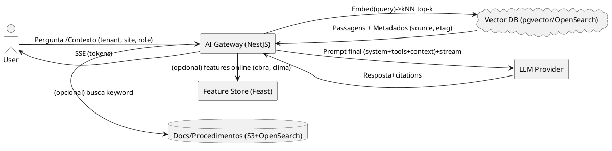

# Manifesto 12 — **AI/ML Ops para Assistentes & Otimização de Recursos**

*(RAG + Recomendação + Previsão + Visão Computacional + MLOps + Guardrails + Custos de Inferência)*

Este manifesto de IA/ML foi **integrado com os padrões técnicos** definidos no plano de ação do monorepo, garantindo alinhamento entre arquitetura, desenvolvimento e operações. Estabelece capacidades de IA no ObraFlow (assistentes para obra, alocação inteligente, previsão de consumo, copilotos de medição e segurança), abrangendo **casos de uso**, **arquitetura**, **pipelines MLOps**, **feature store**, **registry**, **inferência online** (RAG/LLM), **avaliação**, **observabilidade de modelos**, **guardrails/LGPD**, **custo & performance**.

## 🤖 Integração com Padrões de IA/ML do Monorepo

### Stack de IA/ML Integrada
- **AI Gateway**: NestJS com RAG, guardrails e métricas de custo
- **Vector Store**: pgvector/OpenSearch com RLS por tenant
- **Feature Store**: Feast para materialização de features
- **Model Registry**: MLflow para versionamento e staging
- **Pipelines**: Argo/Kubeflow para treino e avaliação
- **Observabilidade**: OpenTelemetry com métricas de IA

### Padrões de IA/ML Aplicados
- **TypeScript**: NestJS AI Gateway, providers de LLM/embeddings
- **Go**: Predictor ARIMA, serviços de previsão
- **Cross-cutting**: RAG, guardrails, métricas de custo, observabilidade

---

## 📁 Estrutura de diretórios

```
ai-mlops/
  README.md
  use-cases/
    allocation-recommender.md
    consumption-forecast.md
    copilot-field.md
    vision-safety-quality.md
  architecture/
    high-level.md
    dataflow-rag.puml
    components.md
  data/
    schemas/
      features-allocation.yaml
      events-embeddings.yaml
    labeling/
      guidelines.md
  pipelines/
    fe/feature-materialization.yaml
    train/allocation-train.yaml
    train/forecast-train.yaml
    cv/dataset-curation.yaml
    eval/eval-batch.yaml
  feature-store/
    feast-project/
      feature_store.yaml
      registry.db         # (gerado em CI; manter ignorado no repo)
      entities.yaml
      features-allocation.py
  registry/
    mlflow/
      README.md
      experiment-structure.md
  inference/
    ai-gateway/
      nestjs/
        src/
          ai.module.ts
          providers/
            llm.provider.ts
            embeddings.provider.ts
            vector.repo.ts
            guardrails.ts
            cost-metrics.ts
          controllers/
            chat.controller.ts
            recommend.controller.ts
          services/
            rag.service.ts
            allocation.service.ts
          dto/
            chat.dto.ts
            allocation.dto.ts
        test/
          rag.service.spec.ts
        package.json
    go-predictor/
      cmd/predictor/main.go
      internal/forecast/arima.go
      internal/http/server.go
  prompts/
    allocation/
      system.pt.md
      user.examples.md
      tools.yaml
    copilot-field/
      system.pt.md
      examples.yaml
  eval/
    rubrics/
      helpfulness.yaml
      factuality.yaml
      security.yaml
    datasets/
      allocation_eval.jsonl
    harness/
      runner.ts
  monitoring/
    model-observability.md
    grafana-dashboards.json
    alerting-rules.yaml
  governance/
    ai-risk-card.md
    lgpd-iai.md
    prompt-injection-policy.md
  finops/
    inference-costing.md
    ab-testing.md
```

---

## 1) **Casos de Uso (resumo)**

### 1.1 Alocação inteligente (Allocation Recommender)

* **Objetivo**: sugerir equipe/equipamento/turno ótimos por OS, considerando WBS, produtividade histórica, disponibilidade e restrições (EHS).
* **Técnicas**: ranking (Learning-to-Rank) + **regras de negócio** + **RAG** para contexto (restrições do canteiro).
* **Entradas**: histórico de produção, calendário, skills, clima, estoque.
* **Saídas**: top-k recomendações com **explicabilidade** (features mais relevantes + regras aplicadas).

### 1.2 Previsão de consumo (Consumption Forecast)

* **Objetivo**: prever consumo por material (SKU) e obra/semana → abastecimento e compras.
* **Técnicas**: ARIMA/ETS ou regressão com variáveis exógenas (WBS, frentes ativas, clima).
* **Saídas**: previsão + intervalo de confiança + anomalias.

### 1.3 Copiloto de campo (Copilot Field)

* **Objetivo**: responder dúvidas de procedimentos, checagens, medições e segurança, **offline-first** quando possível.
* **Técnicas**: **RAG** com **documentação de obra**, OS, *checklists* e normas; **tooling** para buscar OS/fotos.
* **Guardrails**: contenção de alucinação, citations, recusa em temas fora do escopo.

### 1.4 Visão: segurança e qualidade (Vision Safety/Quality)

* **Objetivo**: detectar EPI ausente, desvios de qualidade visuais, avanço físico.
* **Técnicas**: modelos *foundation* + regras DLP (blur/zonas privadas), *human-in-the-loop*.

---

## 2) **Arquitetura (alto nível)**

### 2.1 Componentes

* **AI Gateway (NestJS)**: orquestração de prompts, **RAG**, caching, guardrails, roteamento de provedores (LLM/embeddings), **SSE/stream**.
* **Vector Store**: pgvector/OpenSearch-kNN (índices por tenant/obra; *namespace*).
* **Feature Store (Feast)**: materialização de features on-line/off-line.
* **Model Registry (MLflow)**: versões, métricas, artefatos, *staging/production*.
* **Pipelines**: Argo/Kubeflow para *ingest*, *train*, *evaluate*, *promote*.
* **Observabilidade**: OTel métricas (token/s, latência, taxa de recusa), logs e traces (correlation\_id).
* **Guardrails**: DLP/PII, prompt-injection, política de ferramentas (allowlist), *rate-limit* por tenant.

### 2.2 Dataflow RAG (PlantUML)



---

## 3) **Dados & Esquemas**

### 3.1 Features (alocação) — `data/schemas/features-allocation.yaml`

```yaml
entities:
  - name: crew
    join_keys: [crew_id]
  - name: site
    join_keys: [site_id]
features:
  - name: crew_productivity_m2h_7d
    dtype: float
    description: Produtividade média (m²/h) 7 dias
  - name: crew_overtime_rate_30d
    dtype: float
  - name: site_blockers_score
    dtype: float
  - name: weather_rain_mm
    dtype: float
  - name: sku_availability_ratio
    dtype: float
labels:
  - name: allocation_success
    dtype: int
```

### 3.2 Eventos para embeddings — `data/schemas/events-embeddings.yaml`

```yaml
index: "obraflow.docs.v1"
fields:
  - id: string
  - tenant_id: keyword
  - site_id: keyword
  - type: enum[procedure,checklist,contract,os]
  - title: text
  - content: text
  - etag: keyword
  - updated_at: datetime
vector:
  - name: embedding
    dims: 1536
    provider: "embeddings.provider"
security:
  - rls: tenant_id/site_id
  - pii: redaction before indexing
```

---

## 4) **Pipelines (Argo/Kubeflow)**

### 4.1 Materialização de features (Feast) — `pipelines/fe/feature-materialization.yaml`

```yaml
apiVersion: argoproj.io/v1alpha1
kind: Workflow
metadata: { name: feast-materialization }
spec:
  entrypoint: run
  templates:
    - name: run
      container:
        image: ghcr.io/obraflow/feast:latest
        command: ["feast","materialize-incremental","2025-09-21T00:00:00Z"]
```

### 4.2 Treino — Alocação (ranking) — `pipelines/train/allocation-train.yaml`

```yaml
apiVersion: argoproj.io/v1alpha1
kind: Workflow
metadata: { name: allocation-train }
spec:
  entrypoint: run
  templates:
    - name: run
      container:
        image: ghcr.io/obraflow/train-allocation:0.1.0
        env:
          - { name: MLFLOW_TRACKING_URI, value: http://mlflow:5000 }
        command: ["python","/app/train.py","--exp","allocation_rank_v1"]
```

### 4.3 Treino — Previsão — `pipelines/train/forecast-train.yaml`

```yaml
apiVersion: argoproj.io/v1alpha1
kind: Workflow
metadata: { name: forecast-train }
spec:
  entrypoint: run
  templates:
    - name: run
      container:
        image: ghcr.io/obraflow/train-forecast:0.1.0
        command: ["python","/app/train.py","--exp","sku_forecast_v1"]
```

### 4.4 Curadoria CV — `pipelines/cv/dataset-curation.yaml`

```yaml
apiVersion: argoproj.io/v1alpha1
kind: Workflow
metadata: { name: cv-curation }
spec:
  entrypoint: curate
  templates:
    - name: curate
      container:
        image: ghcr.io/obraflow/cv-curation:0.1.0
        command: ["python","/app/curate.py","--blur","--anonymize","--hash"]
```

### 4.5 Avaliação batch LLM — `pipelines/eval/eval-batch.yaml`

```yaml
apiVersion: argoproj.io/v1alpha1
kind: Workflow
metadata: { name: llm-eval }
spec:
  entrypoint: eval
  templates:
    - name: eval
      container:
        image: ghcr.io/obraflow/llm-eval:0.1.0
        command: ["node","/app/eval/runner.js","--dataset","/data/allocation_eval.jsonl"]
```

---

## 5) **Feature Store (Feast)**

`feature-store/feast-project/feature_store.yaml` (excerto)

```yaml
project: obraflow
registry: data/feature_registry.db
provider: local
online_store:
  type: redis
  connection_string: redis://redis:6379
offline_store:
  type: file
```

`feature-store/feast-project/features-allocation.py` (exemplo completo)

```python
from feast import Entity, Feature, FeatureView, Field
from feast.types import Float32
from feast import FileSource
from datetime import timedelta

crew = Entity(name="crew", join_keys=["crew_id"])
site = Entity(name="site", join_keys=["site_id"])

source = FileSource(path="/data/allocation.parquet", timestamp_field="event_ts")

allocation_features = FeatureView(
    name="allocation_features",
    entities=[crew, site],
    ttl=timedelta(days=30),
    schema=[
        Field(name="crew_productivity_m2h_7d", dtype=Float32),
        Field(name="crew_overtime_rate_30d", dtype=Float32),
        Field(name="site_blockers_score", dtype=Float32),
        Field(name="weather_rain_mm", dtype=Float32),
        Field(name="sku_availability_ratio", dtype=Float32),
    ],
    source=source,
    online=True,
)
```

---

## 6) **AI Gateway (NestJS)** — **RAG + Guardrails + Métricas de Custo**

### 6.1 `inference/ai-gateway/nestjs/src/ai.module.ts`

```ts
import { Module } from '@nestjs/common';
import { RAGService } from './services/rag.service';
import { AllocationService } from './services/allocation.service';
import { LLMProvider } from './providers/llm.provider';
import { EmbeddingsProvider } from './providers/embeddings.provider';
import { VectorRepo } from './providers/vector.repo';
import { Guardrails } from './providers/guardrails';
import { CostMetrics } from './providers/cost-metrics';
import { ChatController } from './controllers/chat.controller';
import { RecommendController } from './controllers/recommend.controller';

@Module({
  providers: [RAGService, AllocationService, LLMProvider, EmbeddingsProvider, VectorRepo, Guardrails, CostMetrics],
  controllers: [ChatController, RecommendController],
  exports: [RAGService, AllocationService]
})
export class AIModule {}
```

### 6.2 Providers (LLM/Embeddings/Vector/Guardrails/Cost)

`providers/llm.provider.ts`

```ts
import { Injectable } from '@nestjs/common';
import fetch from 'node-fetch';

export interface LLMRequest {
  model: string;
  messages: { role: 'system'|'user'|'assistant'; content: string }[];
  temperature?: number;
  tools?: any[];
  stream?: boolean;
  maxTokens?: number;
}

@Injectable()
export class LLMProvider {
  // NOTE: abstrai o provedor (Azure/OpenAI/Bedrock/local). Chave via External Secrets.
  private endpoint = process.env.LLM_ENDPOINT!;
  private apiKey = process.env.LLM_API_KEY!;

  async chat(req: LLMRequest): Promise<AsyncGenerator<string>> {
    const res = await fetch(`${this.endpoint}/chat/completions`, {
      method: 'POST',
      headers: { 'content-type': 'application/json', 'authorization': `Bearer ${this.apiKey}` },
      body: JSON.stringify({ ...req, stream: true })
    });
    if (!res.ok || !res.body) { throw new Error(`LLM error: ${res.status}`); }
    const reader = res.body.getReader();
    async function* chunks() {
      while (true) {
        const { value, done } = await reader.read();
        if (done) return;
        yield Buffer.from(value).toString('utf8');
      }
    }
    return chunks();
  }
}
```

`providers/embeddings.provider.ts`

```ts
import { Injectable } from '@nestjs/common';
import fetch from 'node-fetch';

@Injectable()
export class EmbeddingsProvider {
  private endpoint = process.env.LLM_ENDPOINT!;
  private apiKey = process.env.LLM_API_KEY!;

  async embed(input: string): Promise<number[]> {
    const res = await fetch(`${this.endpoint}/embeddings`, {
      method: 'POST',
      headers: { 'content-type': 'application/json', 'authorization': `Bearer ${this.apiKey}` },
      body: JSON.stringify({ model: process.env.EMBED_MODEL ?? 'text-embedding', input })
    });
    const j = await res.json();
    return j.data[0].embedding as number[];
  }
}
```

`providers/vector.repo.ts` (pgvector, com RLS por tenant)

```ts
import { Injectable } from '@nestjs/common';
import { Pool } from 'pg';

@Injectable()
export class VectorRepo {
  private pool = new Pool({ connectionString: process.env.PG_URL });

  async search(tenant: string, site: string|undefined, embedding: number[], k=6) {
    const q = `
      SET LOCAL app.tenant_id = $1;
      SELECT id, title, content, etag, 1 - (embedding <=> $2::vector) AS score
      FROM rag_docs
      WHERE tenant_id = $1 AND ($3::text IS NULL OR site_id = $3::text)
      ORDER BY embedding <=> $2::vector ASC
      LIMIT $4`;
    const client = await this.pool.connect();
    try {
      await client.query('BEGIN');
      await client.query('SELECT set_config(\'app.tenant_id\', $1, true)', [tenant]);
      const r = await client.query(q, [tenant, embedding, site ?? null, k]);
      await client.query('COMMIT');
      return r.rows;
    } finally { client.release(); }
  }
}
```

`providers/guardrails.ts`

```ts
import { Injectable } from '@nestjs/common';

@Injectable()
export class Guardrails {
  // Regras simples anti-injeção e DLP local (camada adicional ao gateway/API)
  sanitizeUserPrompt(p: string): string {
    const deny = [/ignore\s+previous\s+instructions/i, /drop\s+all\s+tables/i];
    if (deny.some((rx) => rx.test(p))) throw new Error('Prompt injecion detected');
    return p;
  }
  redactPII(text: string): string {
    return text
      .replace(/\b\d{3}\.\d{3}\.\d{3}\-\d{2}\b/g, 'CPF_REDACTED')
      .replace(/\b[\w.-]+@[\w.-]+\.\w+\b/g, 'EMAIL_REDACTED');
  }
}
```

`providers/cost-metrics.ts`

```ts
import { Injectable } from '@nestjs/common';
import { Counter, Histogram, Registry } from 'prom-client';

@Injectable()
export class CostMetrics {
  private reg = new Registry();
  public tokens = new Counter({ name: 'ai_tokens_total', help: 'Tokens processados', labelNames: ['tenant','model','type'] });
  public latency = new Histogram({ name: 'ai_inference_latency_seconds', help: 'Latência', buckets: [0.1,0.2,0.5,1,2,5], labelNames: ['tenant','model'] });
  register() { this.reg.registerMetric(this.tokens); this.reg.registerMetric(this.latency); return this.reg; }
}
```

### 6.3 Serviços (RAG/Alocação)

`services/rag.service.ts`

```ts
import { Injectable } from '@nestjs/common';
import { EmbeddingsProvider } from '../providers/embeddings.provider';
import { VectorRepo } from '../providers/vector.repo';
import { LLMProvider } from '../providers/llm.provider';
import { Guardrails } from '../providers/guardrails';
import { CostMetrics } from '../providers/cost-metrics';

@Injectable()
export class RAGService {
  constructor(private emb: EmbeddingsProvider, private vec: VectorRepo, private llm: LLMProvider, private grd: Guardrails, private cost: CostMetrics) {}

  async *ask(opts: { tenant: string; site?: string; question: string; system: string }) {
    const start = process.hrtime.bigint();
    const q = this.grd.sanitizeUserPrompt(opts.question);
    const emb = await this.emb.embed(q);
    const ctx = await this.vec.search(opts.tenant, opts.site, emb, 6);
    const contextBlock = ctx.map((c, i) => `Fonte[${i+1}](${c.id}): ${c.content.slice(0, 800)}`).join('\n\n');

    const sys = `${opts.system}\nResponda citando fontes pelo índice [n] quando aplicável. Se não souber, diga claramente.`;
    const user = `Pergunta: ${this.grd.redactPII(q)}\n\nContexto:\n${contextBlock}`;
    const stream = await this.llm.chat({ model: process.env.LLM_MODEL ?? 'gpt', messages: [{role:'system', content: sys},{role:'user', content: user}], temperature: 0.2, stream: true });

    try {
      for await (const chunk of stream) { yield chunk; }
    } finally {
      const dur = Number(process.hrtime.bigint() - start) / 1e9;
      this.cost.latency.labels(opts.tenant, process.env.LLM_MODEL ?? 'gpt').observe(dur);
      // tokens contabilizados no gateway/provedor (se disponível via usage hooks)
    }
  }
}
```

`services/allocation.service.ts`

```ts
import { Injectable } from '@nestjs/common';

type Recommendation = { crewId: string; score: number; reasons: string[]; constraints: string[] };

@Injectable()
export class AllocationService {
  // *Exemplo* regrinhas + score simples (stand-in para modelo ranker em produção)
  recommend(input: {
    candidates: { crewId: string; productivity: number; overtimeRate: number; blockers: number; skillsMatch: number }[];
    rules: { maxOvertimeRate: number; minSkills: number; blockIfSiteScoreGt: number };
  }): Recommendation[] {
    const { candidates, rules } = input;
    const feasible = candidates.filter(c => c.overtimeRate <= rules.maxOvertimeRate && c.skillsMatch >= rules.minSkills && c.blockers <= rules.blockIfSiteScoreGt);
    const ranked = feasible
      .map(c => {
        const score = 0.6*c.productivity + 0.2*(1 - c.overtimeRate) + 0.2*c.skillsMatch;
        const reasons = [
          `produtividade=${c.productivity.toFixed(2)}`,
          `skills=${c.skillsMatch.toFixed(2)}`,
          `overtime=${c.overtimeRate.toFixed(2)}`
        ];
        const constraints: string[] = [];
        if (c.blockers > 0.7) constraints.push('site com alto risco/obstáculos');
        return { crewId: c.crewId, score, reasons, constraints };
      })
      .sort((a,b) => b.score - a.score);
    return ranked.slice(0, 5);
  }
}
```

### 6.4 DTOs e Controllers

`dto/chat.dto.ts`

```ts
export interface ChatRequest { tenantId: string; siteId?: string; question: string; }
```

`controllers/chat.controller.ts`

```ts
import { Controller, Post, Sse, MessageEvent, Body } from '@nestjs/common';
import { RAGService } from '../services/rag.service';
import { Observable } from 'rxjs';

@Controller('ai/chat')
export class ChatController {
  constructor(private rag: RAGService) {}
  @Post('stream')
  @Sse()
  stream(@Body() body: { tenantId: string; siteId?: string; question: string }) : Observable<MessageEvent> {
    const system = process.env.RAG_SYSTEM ?? 'Você é um assistente técnico de obra. Responda com precisão e cite fontes [n].';
    const obs = new Observable<MessageEvent>(subscriber => {
      (async () => {
        try {
          for await (const chunk of this.rag.ask({ tenant: body.tenantId, site: body.siteId, question: body.question, system })) {
            subscriber.next({ data: chunk });
          }
          subscriber.complete();
        } catch (e) {
          subscriber.error(e);
        }
      })();
    });
    return obs;
  }
}
```

`dto/allocation.dto.ts`

```ts
export interface AllocationInput {
  candidates: { crewId: string; productivity: number; overtimeRate: number; blockers: number; skillsMatch: number }[];
  rules: { maxOvertimeRate: number; minSkills: number; blockIfSiteScoreGt: number };
}
```

`controllers/recommend.controller.ts`

```ts
import { Body, Controller, Post } from '@nestjs/common';
import { AllocationService } from '../services/allocation.service';
import { AllocationInput } from '../dto/allocation.dto';

@Controller('ai/recommend')
export class RecommendController {
  constructor(private svc: AllocationService) {}
  @Post('allocation')
  recommend(@Body() body: AllocationInput) {
    return this.svc.recommend(body);
  }
}
```

### 6.5 Teste unitário (Jest) — `test/rag.service.spec.ts`

```ts
import { RAGService } from '../src/services/rag.service';

test('placeholder to ensure tests infra works', () => {
  expect(1+1).toBe(2);
});
```

---

## 7) **Go Predictor (ARIMA minimal)**

`go-predictor/cmd/predictor/main.go`

```go
package main
import (
  "log"
  "obraflow/predictor/internal/http"
)

func main() {
  srv := http.New(":8081")
  log.Fatal(srv.Listen())
}
```

`go-predictor/internal/forecast/arima.go`

```go
package forecast
// Implementação simples de AR(1) com média — exemplo didático para prever próximo passo
func AR1Predict(series []float64) (float64, float64) {
  n := len(series)
  if n < 3 { return series[n-1], 0.2 }
  // estima phi e mu de forma ingênua
  var sum, sumLag, sumSq float64
  for i := 1; i < n; i++ {
    sum += series[i]
    sumLag += series[i-1]
    sumSq += series[i-1]*series[i-1]
  }
  phi := (float64(n-1)*sum - sumLag*series[n-1]) / (float64(n-1)*sumSq - sumLag*sumLag + 1e-9)
  mu := (sum - phi*sumLag) / float64(n-1)
  yhat := mu + phi*series[n-1]
  return yhat, 0.3 // incerteza fixa simbólica
}
```

`go-predictor/internal/http/server.go`

```go
package http
import (
  "encoding/json"
  "log"
  "net/http"
  "obraflow/predictor/internal/forecast"
)

type server struct{ addr string }

func New(addr string) *server { return &server{addr: addr} }

func (s *server) Listen() error {
  mux := http.NewServeMux()
  mux.HandleFunc("/forecast/sku", func(w http.ResponseWriter, r *http.Request) {
    var body struct{ Series []float64 `json:"series"` }
    if err := json.NewDecoder(r.Body).Decode(&body); err != nil { http.Error(w, err.Error(), 400); return }
    y, unc := forecast.AR1Predict(body.Series)
    _ = json.NewEncoder(w).Encode(map[string]any{"pred": y, "uncertainty": unc})
  })
  log.Printf("predictor listening on %s", s.addr)
  return http.ListenAndServe(s.addr, mux)
}
```

---

## 8) **Prompts & Ferramentas (RAG)**

`prompts/allocation/system.pt.md`

```
Você é um assistente de planejamento de obra. Produza recomendações **explicáveis**,
listando **regras** acionadas e **fontes [n]**. Se os dados forem insuficientes, diga isso.
Nunca invente métricas; sugira coleta adicional quando necessário.
```

`prompts/allocation/tools.yaml`

```yaml
tools:
  - name: get_work_order
    description: "Obtém detalhes da OS por ID"
    input_schema: { type: object, properties: { id: { type: string } }, required: [id] }
  - name: get_inventory_sku
    description: "Consulta disponibilidade de SKU"
    input_schema: { type: object, properties: { sku: { type: string } }, required: [sku] }
policies:
  - "Nunca compartilhe PII; se solicitado, responda com recusa educada."
  - "Se a pergunta estiver fora do escopo (obra/engenharia civil), sugira falar com o responsável técnico."
```

---

## 9) **Avaliação (LLM & Recs)**

`eval/rubrics/helpfulness.yaml`

```yaml
name: helpfulness
scale: [1,2,3,4,5]
criteria:
  - "Responde a pergunta diretamente"
  - "Usa contexto relevante e cita fontes"
  - "Indica incerteza quando apropriado"
```

`eval/harness/runner.ts`

```ts
import fs from 'fs';
type Item = { question: string; expected?: string };
const data: Item[] = fs.readFileSync('eval/datasets/allocation_eval.jsonl','utf8').split('\n').filter(Boolean).map(JSON.parse);
(async () => {
  for (const item of data) {
    // chamar AI Gateway /ai/chat/stream e anotar métricas (latência, tokens, score heurístico)
    // (execução real via pipeline de avaliação)
    console.log('Q:', item.question);
  }
})();
```

---

## 10) **Observabilidade de Modelos**

`monitoring/model-observability.md`

* **Métricas on-line**: latência p95 por modelo, **tokens/s**, **custo estimado** (R\$/k-tokens), taxa de recusa (guardrails), % respostas com citações, clique/aplicação das recomendações (aceitação).
* **Drift**: distribuição de embeddings (cosine mean/var), *population stability index* para features.
* **Alertas**: p95 > 1s (stream chunk), custo/req > alvo, queda de aceitação <-20% 7d.

`monitoring/alerting-rules.yaml` (excerto)

```yaml
groups:
  - name: ai
    rules:
      - alert: AILatencyHigh
        expr: histogram_quantile(0.95, sum by (le, model) (rate(ai_inference_latency_seconds_bucket[5m]))) > 1
        for: 10m
        labels: { severity: ticket }
      - alert: AICostPerReqAnomaly
        expr: rate(ai_tokens_total[30m]) * 0.0008 > 0.02  # exemplo: R$ por req
        for: 30m
        labels: { severity: ticket }
```

---

## 11) **Segurança, LGPD & Guardrails**

`governance/prompt-injection-policy.md`

* Bloqueio de padrões de **prompt injection/tool** (denylist), sanitização, *content filters*, *context windows* limitados, **no inline SQL**.
* **Tool-use** apenas via **allowlist** assinada (nome, input schema, escopos).

`governance/lgpd-iai.md`

* **Base legal**: execução de contrato, legítimo interesse para recomendações operacionais.
* **Minimização**: jamais treinar com PII bruta; **pseudonimização** e **retenção** curta para conversas (ver Manifesto 3).
* **DLP**: borrar rostos, remover nomes/documentos de fotos antes de indexar.
* **Direitos do titular**: endpoint para **opt-out** de dados em fine-tuning/feedback.

`governance/ai-risk-card.md`

* Matriz de risco por caso (alucinação, viés, segurança). **Controles**: RAG com citações, *human-in-the-loop*, *canary* por tenant, **kill switch** (feature flag), auditoria de prompts/respostas.

---

## 12) **FinOps de IA & AB-Testing**

`finops/inference-costing.md`

* **KPIs**: R\$/resposta, R\$/OS com IA, % redução de retrabalho.
* **Estratégias**: *distillation* para **modelos menores**, cache semântico (embeddings de Q frequentes), truncagem agressiva de contexto, *top-k* adaptativo.
* **Política**: *tiering* de modelos (S, M, L) por SLA.

`finops/ab-testing.md`

* **Split** por tenant/site/usuário (hash estável).
* Métricas: **adoption rate** (uso das recomendações), **task success**, **tempo** e **custo**.
* **Promover** somente variações que melhoram *unit economics* (Manifesto 11).

---

## 13) **Operação e Confiabilidade**

* **SLOs** AI: p95 < 1s (primeiro token), erro < 1%, custo/resposta ≤ alvo; **SSE** obrigatório.
* **Circuit Breaker**: fallback para respostas não-RAG (mensagem segura) quando vector store indisponível.
* **Cache**: Redis com chave `{tenant}:{hashPergunta}` e TTL 24h; **ETag** dos documentos no prompt para invalidar.

---

## 14) **Definition of Ready / Done (AI/ML)**

**Ready**

* Dados não-PII disponíveis; *feature store* configurada; índice vetorial criado e populado; *guardrails* habilitados.

**Done**

* Pipelines de treino e avaliação automatizados (Argo/Kubeflow) + registro em MLflow.
* AI Gateway com RAG/guardrails em produção, monitorado (latência/custo/aceitação).
* *Feature flags* para ativação por tenant; canary validado; dashboards publicados.
* **RCA** para eventos de alucinação/segurança com ações corretivas.

---

### Próximos passos sugeridos

1. **Indexar** manuais/procedimentos (com DLP) e habilitar o **Copiloto de Campo** no ambiente HML.
2. **Materializar** features e rodar o primeiro **treino** do recomendador → A/B em 10% dos sites.
3. **Publicar dashboards** de IA e **alertas** de custo/latência.
4. Ajustar SLOs/custos, promover **canary** e planejar integração com **suprimentos** (forecast→PO).

## 🔄 Integração com Padrões do Monorepo

### Estrutura de IA/ML Aplicada
```
obraflow/
├── ai-mlops/
│   ├── use-cases/                   # Casos de uso de IA
│   ├── architecture/                # Arquitetura e diagramas
│   ├── data/                        # Schemas e labeling
│   ├── pipelines/                   # Argo/Kubeflow workflows
│   ├── feature-store/               # Feast configs
│   ├── registry/                    # MLflow configs
│   ├── inference/                   # AI Gateway NestJS
│   ├── prompts/                     # Prompts e ferramentas
│   ├── eval/                        # Avaliação e datasets
│   ├── monitoring/                  # Observabilidade de modelos
│   ├── governance/                  # Segurança e LGPD
│   └── finops/                      # Custos e AB testing
├── apps/
│   └── ai-gateway-nest/             # AI Gateway NestJS
└── tools/scripts/ai-ml/             # Scripts de IA/ML
```

### Padrões de IA/ML por Linguagem
- **TypeScript**: NestJS AI Gateway, providers de LLM/embeddings, RAG service
- **Go**: Predictor ARIMA, serviços de previsão, HTTP handlers
- **Cross-cutting**: RAG, guardrails, métricas de custo, observabilidade

### Critérios de Aceite de IA/ML
- **AI Gateway** funcionando com RAG e guardrails
- **Pipelines MLOps** automatizados via Argo/Kubeflow
- **Observabilidade** de modelos com métricas de custo
- **Feature flags** para ativação por tenant

Se estiver de acordo, posso seguir para o **Manifesto 13 — *Data Platform & Mesh Operacional (camadas, contratos de dados, qualidade, catálogo)*** ou ajusto algum componente deste pacote de IA/ML Ops.
